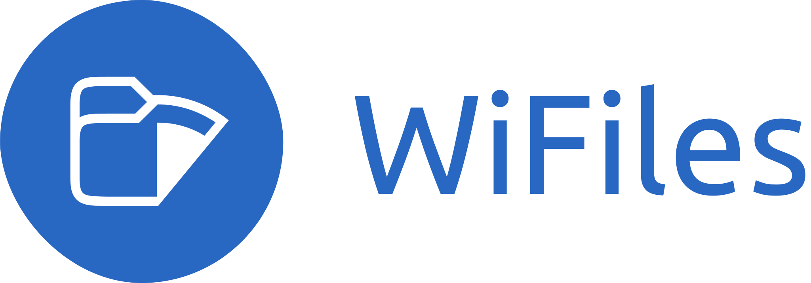

  

**Wi-Files** is a self-hosted private file server that brings a modern, Linux-native file management experience to the web. Inspired by the simplicity and familiarity of Ubuntu GNOME Files (Nautilus), WiFiles allows you to securely access, browse, manage, and stream files from your Linux machine through any web browser.

Whether you're on your phone, tablet, or another computer, WiFiles turns your Linux desktop into a personal cloud while keeping your data under your control.

### Features
- Access files from any web browser
- Browse local directories and mounted drives
- Mobile-friendly interface inspired by GNOME Files (Nautilus)
- Secure authentication using Linux user accounts
- File upload and download support
- Media streaming directly from your device
- Self-hosted and privacy-focused
- Lightweight and easy to deploy

## Project Status

WiFiles is currently under active development.

The project is focused on building a polished GNOME Files-inspired user experience, a robust Go backend, and a secure Linux-native authentication and file access system. Features and APIs may change as development progresses.

## Contributing

Contributions, feedback, and feature suggestions are welcome.

Before contributing, please read the [guidelines](CONTRIBUTING.md).

## License

This project is licensed under the [MIT License](LICENSE).
